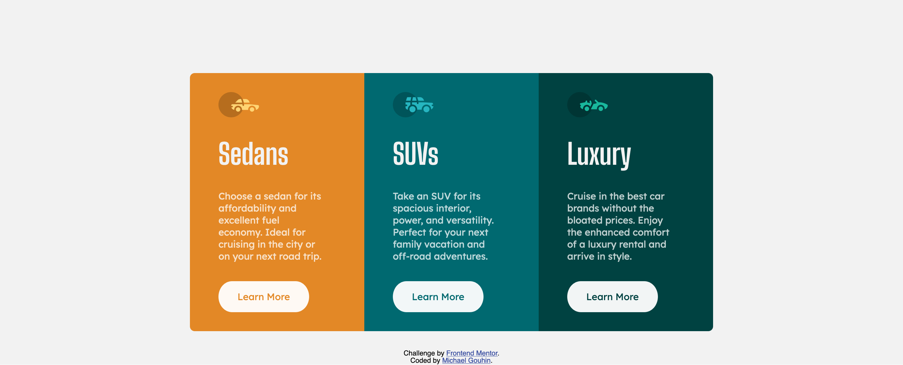

# Frontend Mentor - 3-column preview card component solution

This is a solution to the [3-column preview card component challenge on Frontend Mentor](https://www.frontendmentor.io/challenges/3column-preview-card-component-pH92eAR2-). Frontend Mentor challenges help you improve your coding skills by building realistic projects. 

## Table of contents

- [Overview](#overview)
  - [The challenge](#the-challenge)
  - [Screenshot](#screenshot)
  - [Links](#links)
- [My process](#my-process)
  - [Built with](#built-with)
  - [What I learned](#what-i-learned)
  - [Continued development](#continued-development)
  - [Useful resources](#useful-resources)
- [Author](#author)

## Overview

### The challenge

Build out a website that looks the same as the prompt. Use style guides as given, inspect the images for best guesses on feature sizing and spacing. Use best practices in implementation.

Users should be able to:
- View the optimal layout depending on their device's screen size
- See hover states for interactive elements

### Screenshot



### Links

- Solution URL: [https://github.com/mgouhin/frontend-mentor/tree/master/3-column-preview-card-component-main](https://github.com/mgouhin/frontend-mentor/tree/master/3-column-preview-card-component-main)
- Live Site URL: [Ahttps://mgouhin-fem.netlify.app/3-column-preview-card-component-main/index.html](https://mgouhin-fem.netlify.app/3-column-preview-card-component-main/index.html)

## My process

### Built with

- Semantic HTML5 markup
- CSS custom properties
- Flexbox
- CSS Grid
- CSS BEM methodology
- Mobile-first workflow

### What I learned

Use this section to recap over some of your major learnings while working through this project. Writing these out and providing code samples of areas you want to highlight is a great way to reinforce your own knowledge.

To see how you can add code snippets, see below:

```html
<h1>Some HTML code I'm proud of</h1>
```
```css
.proud-of-this-css {
  color: papayawhip;
}
```
```js
const proudOfThisFunc = () => {
  console.log('🎉')
}
```

If you want more help with writing markdown, we'd recommend checking out [The Markdown Guide](https://www.markdownguide.org/) to learn more.

**Note: Delete this note and the content within this section and replace with your own learnings.**

### Continued development

I worked on using BEM /(Block Element Modifier/) CSS methodology for organizing my styling on this project. I think it worked well, but since the scope wasn't huge I don't think I was able to reap in any significant benefits, none the less good practice. Anyway, working with some of these methodologies for long term maintainability is something I'd like to continue doing. 

Also I'd like to get back to JS and work on building some simple scripts and getting back up to speed.

### Useful resources

- [W3 Schools](https://www.w3schools.com/) - Like a cheat sheet for web development.
- [MDN Web Docks](https://developer.mozilla.org/en-US/docs/Web) - Great reference for finding out the specifics and workings of HTML, CSS, JS, and more.
- [VS Code Live Server](https://marketplace.visualstudio.com/items?itemName=ritwickdey.LiveServer) - Let's you set up a local server and get quick feedback on projects without a bunch of hassle.
- [Netlify](https://www.netlify.com/) - Easy deploy to a broader audience for your project.

## Author

- GitHub - [@mgouhin](https://github.com/mgouhin)
- Frontend Mentor - [@mgouhin](https://www.frontendmentor.io/profile/mgouhin)
- Twitter - [@goingmike](https://www.twitter.com/mgouhin)