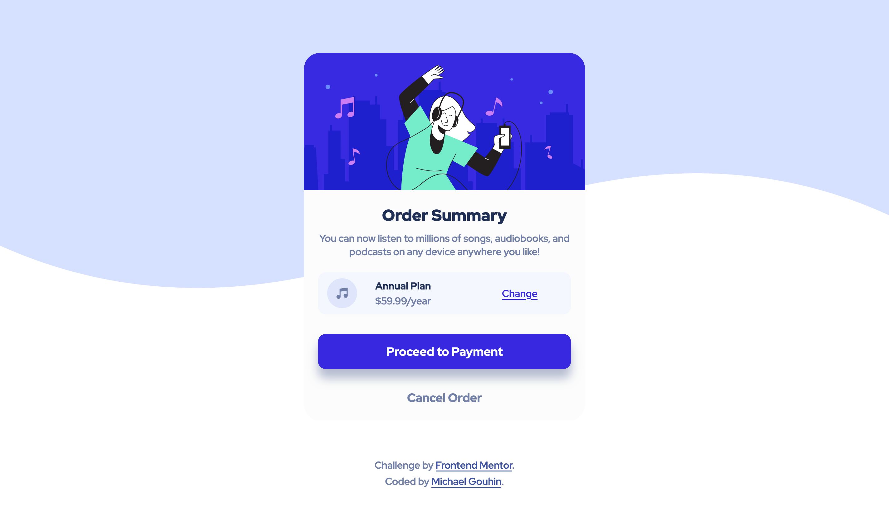

# Frontend Mentor - Order summary card solution

This is a solution to the [Order summary card challenge on Frontend Mentor](https://www.frontendmentor.io/challenges/order-summary-component-QlPmajDUj). Frontend Mentor challenges help you improve your coding skills by building realistic projects. 

## Table of contents

- [Overview](#overview)
  - [The challenge](#the-challenge)
  - [Screenshot](#screenshot)
  - [Links](#links)
- [My process](#my-process)
  - [Built with](#built-with)
  - [What I learned](#what-i-learned)
  - [Continued development](#continued-development)
  - [Useful resources](#useful-resources)
- [Author](#author)
- [Acknowledgments](#acknowledgments)

## Overview

### The challenge

Build out a website that looks the same as the prompt. Use style guides as given, inspect the images for best guesses on feature sizing and spacing. Users should be able to see hover states for interactive elements. Use best practices in implementation.

### Screenshot

### Links

- Solution URL: [https://github.com/mgouhin/frontend-mentor/tree/master/order-summary-component-main](https://github.com/mgouhin/frontend-mentor/tree/master/order-summary-component-main)
- Live Site URL: [https://mgouhin-fem.netlify.app/order-summary-component-main/index.html](https://mgouhin-fem.netlify.app/order-summary-component-main/index.html)

## My process

I started with the template file and then started adding HTML to structure the webpage. I added the images in and some div elements to start structuring the page. From there I made a separate stylesheet and started on the body of the page and worked my way in. 

I used the LiveServer extension for VS Code to continuously preview my changes working bit by bit. It's been a while since I made a webpage, so I was definitely taking it slow
and looking up references as I built the page.

### Built with

- Semantic HTML5 markup
- CSS custom properties
- Flexbox
- Mobile-first workflow

### What I learned

This project was more so about getting back up to speed after stepping away for ~8 months. See the continued development section for what I'm focusing on next!

Actually, after submitting my code I saw that I had accessibility issues. I learned about HTML landmark elements such as `<header>, <nav>, <main>, <section>, <aside>, <footer>`. I updated my project with those replacing some of my `
` elements. 

### Continued development

This was very much a brush up on skills type of project along with trying to make forward progress learning. That being said I'd like to improve my structuring of CSS. I'm not that confident in it working 100% of the time on different configurations. Also, I'd like to figure out design frameworks that make sure styling is easy to maintain over the long run.

One thing I am proud of with this development is using Netlify. My first time using it and it was way too easy to setup. I didn't spend that much time with it unfortunately just enough to get running. Definitely would love to learn more, but I'd like to put more effort into getting back up to speed with JS first.

### Useful resources

- [W3 Schools](https://www.w3schools.com/) - Like a cheat sheet for web development.
- [MDN Web Docks](https://developer.mozilla.org/en-US/docs/Web) - Great reference for finding out the specifics and workings of HTML, CSS, JS, and more.
- [VS Code Live Server](https://marketplace.visualstudio.com/items?itemName=ritwickdey.LiveServer) - Let's you set up a local server and get quick feedback on projects without a bunch of hassle.
- [Netlify](https://www.netlify.com/) - Easy deploy to a broader audience for your project.

## Author

- GitHub - [@mgouhin](https://github.com/mgouhin)
- Frontend Mentor - [@mgouhin](https://www.frontendmentor.io/profile/mgouhin)
- Twitter - [@goingmike](https://www.twitter.com/mgouhin)

## Acknowledgments

Special thanks to Frontend Mentor and their great project ideas and starter packages, Netlify for making it all to easy to deploy these projects, and Ritwick Dey for developing the awesome VS Code Extension Live Server.
