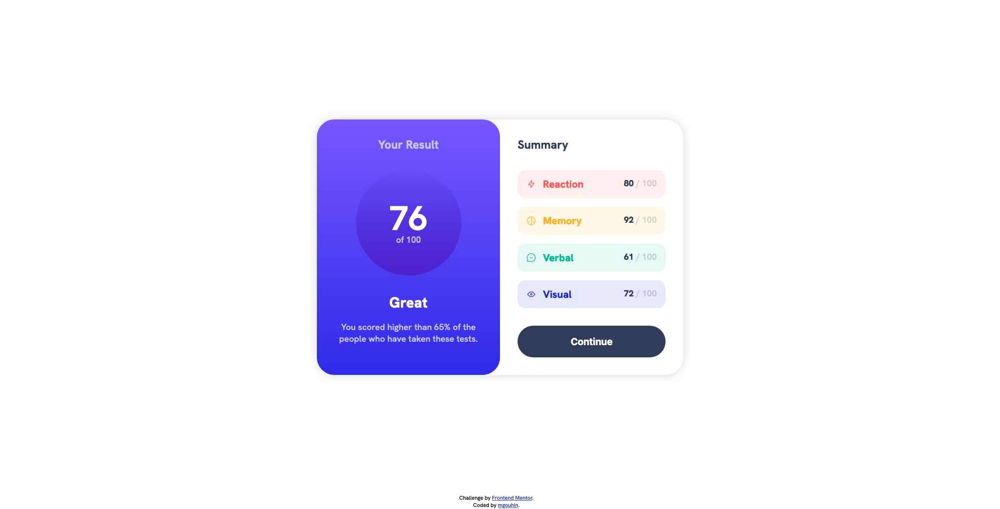

# Frontend Mentor - Results summary component solution

This is a solution to the [Results summary component challenge on Frontend Mentor](https://www.frontendmentor.io/challenges/results-summary-component-CE_K6s0maV). Frontend Mentor challenges help you improve your coding skills by building realistic projects. 

## Table of contents

- [Overview](#overview)
  - [The challenge](#the-challenge)
  - [Screenshot](#screenshot)
  - [Links](#links)
- [My process](#my-process)
  - [Built with](#built-with)
  - [What I learned](#what-i-learned)
  - [Continued development](#continued-development)
  - [Useful resources](#useful-resources)
- [Author](#author)
- [Acknowledgments](#acknowledgments)

## Overview

### The challenge

Users should be able to:

- View the optimal layout for the interface depending on their device's screen size
- See hover and focus states for all interactive elements on the page

### Screenshot



### Links

- Solution URL: [https://github.com/mgouhin/frontend-mentor/tree/master/results-summary-component-main](https://github.com/mgouhin/frontend-mentor/tree/master/results-summary-component-main)
- Live Site URL: [https://mgouhin-fem.netlify.app/results-summary-component-main/index.html](https://mgouhin-fem.netlify.app/results-summary-component-main/index.html)

## My process

### Built with

- Semantic HTML5 markup
- CSS custom properties
- Flexbox
- CSS Grid
- Mobile-first workflow

### What I learned

It may sound simple and silly, but I learned about typography inheritance on this project. Specifically how font size, weight, and color are inherited by children elements and how it's important to utilize this to save yourself work. I picked this up from [Kevin Powell](https://www.kevinpowell.co/) and tried to use it in a few places that made sense.

One instance of it was applying a neutral font color `clr-neutral-700` to the `<section>` element in the summary card. This reduced some of the work for reapplying it on sub-components.

```html
<section class="card clr-neutral-700">

          <h2 class="txt-left fs-600 fw-bold">Summary</h2>

          <div class="grid clr-neutral-700-light">

            <div class="score-component bg-primary-red-light">
              <div class="icon-title">
                
                <h3 class="clr-primary-red">Reaction</h3>
              </div>
              <p class="fw-bold"><span class="fw-extra-bold clr-neutral-700">80</span> / 100</p>
            </div>
```

### Continued development

I'd like to work further on my CSS Flexbox and Grid utilization. Visually laying out the components, getting appropriate spacing, and choosing containers had its challenging moments for me. I also suspect I'm not using their properties to my full advantage or efficiently. Rather I'm sticking together their basic functions to get what I want. 

Another goal would be to improve my overall CSS structure. Learning how to balance getting the work done with designing for adaptability and/or scaling. Designing for a single page item versus designing for an entire application seem to have different goals. Learning how to structure my CSS so it can be modified or expanded easily seems like a valuable skill.

### Useful resources

Definitely utilized some of the big names for reference on this project.

- [W3 Schools](https://www.w3schools.com/css/default.asp) - Great reference for summarized ideas/concepts of HTML, CSS, JS, and more. I used it quite a bit for quick recall items.
- [Mozilla Developer Network](https://developer.mozilla.org/en-US/docs/Web/CSS) - Great resource for explaining how aspects of HTML, CSS, and JS work. Well put together and organized coherently for easy use and learning. I relied on this for getting CSS grid to behave for me.

## Author

- Frontend Mentor - [@mgouhin](https://www.frontendmentor.io/profile/mgouhin)
- GitHub - [@mgouhin](https://github.com/mgouhin)

## Acknowledgments

Special thanks to [Kevin Powell](https://www.kevinpowell.co/) for his [solution](https://www.youtube.com/watch?v=KqFAs5d3Yl8). I was nearing the close of this project when he released his video. I really enjoyed it and it gave me the motivation to cross the finish line.
